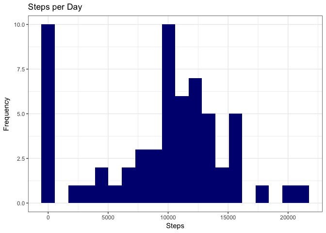
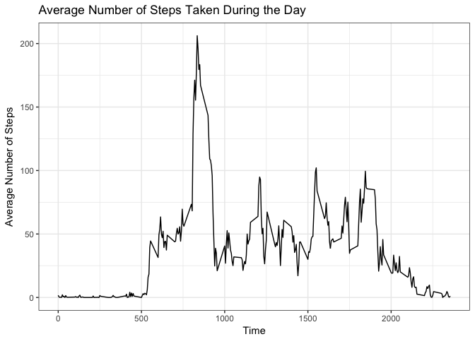
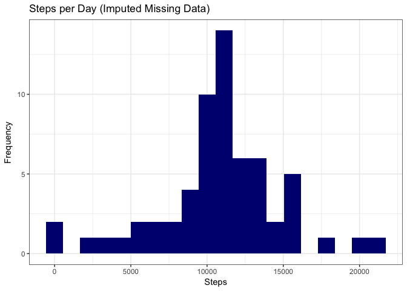
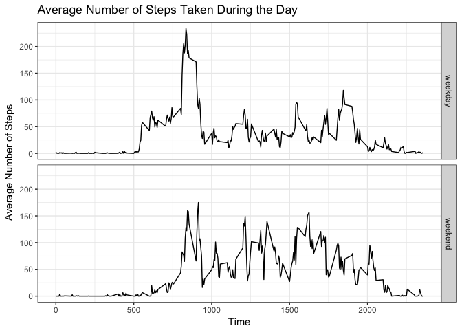

# Reproducible Research: Peer Assessment 1


###Load data

```r
library(dplyr)
```

```
## Warning: package 'dplyr' was built under R version 3.3.2
```

```
## 
## Attaching package: 'dplyr'
```

```
## The following objects are masked from 'package:stats':
## 
##     filter, lag
```

```
## The following objects are masked from 'package:base':
## 
##     intersect, setdiff, setequal, union
```

```r
library(ggplot2)
```

```
## Warning: package 'ggplot2' was built under R version 3.3.2
```

```r
#Set working directory
setwd("~/Dropbox/AndersenLab/LabFolders/Katie/projects/miscellaneous/RepData_PeerAssessment1/")

#Load the data
activity <- read.table(unz("activity.zip", "activity.csv"), sep = ",", 
                      na.strings = "NA", header = TRUE)
```

###What is the mean total number of steps taken per day? Ignoring incomplete data.

```r
#find the number of steps taken per day
steps <- activity %>%
    dplyr::group_by(date) %>%
    dplyr::mutate(steps_per_day = sum(steps, na.rm = T)) %>%
    dplyr::distinct(date,.keep_all = T)
```

```
## Warning: package 'bindrcpp' was built under R version 3.3.2
```

```r
#plot histogram
ggplot(data = steps, aes(x = steps_per_day)) +
    geom_histogram(bins = 20, fill = "navyblue") + 
    labs(x = "Steps", y = "Frequency", title = "Steps per Day") +
    theme_bw()
```

<!-- -->

```r
#calculate the mean
mean <- mean(steps$steps_per_day, na.rm = T)
print(paste0("The mean number of steps taken per day is ", mean, " steps."))
```

```
## [1] "The mean number of steps taken per day is 9354.22950819672 steps."
```

```r
#calculate the median
median <- median(steps$steps_per_day, na.rm = T)
print(paste0("The median number of steps taken per day is ", median, " steps."))
```

```
## [1] "The median number of steps taken per day is 10395 steps."
```

###What is the average daily pattern?

```r
#average the number of steps taken per 5 min interval across all days
intervals <- activity %>%
    dplyr::group_by(interval) %>%
    dplyr::summarise(avg_steps = mean(steps, na.rm = T))

#plot data as a line graph
ggplot(data = intervals, aes(x = interval, y = avg_steps)) +
    geom_line() +
    labs(x = "Time", y = "Average Number of Steps", title = "Average Number of Steps Taken During the Day")+
    theme_bw()
```

<!-- -->

```r
#which 5-min interval has the most average number of steps?
max_int <- intervals$interval[which.max(intervals$avg_steps)]
print(paste0("The ", max_int, "th 5-min interval has the most number of steps taken during the day, on average."))
```

```
## [1] "The 835th 5-min interval has the most number of steps taken during the day, on average."
```

###Imputing missing values

```r
#calculate total number of rows with NAs
numNA <- nrow(activity[is.na(activity),])
print(paste0(numNA, " missing values in the Activity dataset."))
```

```
## [1] "2304 missing values in the Activity dataset."
```

```r
#fill in missing values with the average steps for that time interval across all days with values
activity_noNA <- activity %>%
    dplyr::group_by(interval) %>%
    dplyr::mutate(avg_steps = mean(steps, na.rm = T), 
                  fixed_steps = ifelse(is.na(steps), avg_steps, steps))

steps_noNA <- activity_noNA %>%
    dplyr::group_by(date) %>%
    dplyr::summarise(steps_per_day = sum(fixed_steps, na.rm = T))

#make histogram with imputed dataset
ggplot(data = steps_noNA, aes(x = steps_per_day)) +
    geom_histogram(bins = 20, fill = "navyblue") + 
    labs(x = "Steps", y = "Frequency", title = "Steps per Day (Imputed Missing Data)")+
    theme_bw()
```

<!-- -->

```r
#calculate the mean
mean_noNA <- mean(steps_noNA$steps_per_day, na.rm = T)
print(paste0("The mean number of steps taken per day (with imputed missing data) is ", mean_noNA, " steps."))
```

```
## [1] "The mean number of steps taken per day (with imputed missing data) is 10766.1886792453 steps."
```

```r
#calculate the median
median_noNA <- median(steps_noNA$steps_per_day, na.rm = T)
print(paste0("The median number of steps taken per day (with imputed missing data) is ", median_noNA, " steps."))
```

```
## [1] "The median number of steps taken per day (with imputed missing data) is 10766.1886792453 steps."
```

Both the median and mean steps taken per day increased with the dataset with imputed missing values. The new median and mean are identical.

###Are there differences in activity patterns on weekends vs. weekdays?

```r
#create new weekday/weekend factor in dataset
weekday <- activity_noNA %>%
    dplyr::mutate(day = ifelse(weekdays(as.Date(date)) %in% c("Saturday", "Sunday"), "weekend", "weekday"))

#change weekday to a factor variable
weekday$day <- as.factor(weekday$day)

#average the number of steps taken per 5 min interval across all days
week_intervals <- weekday %>%
    dplyr::group_by(interval, day) %>%
    dplyr::summarise(avg_steps = mean(steps, na.rm = T))

#plot data as a line graph split by weekday and weekend
ggplot(data = week_intervals, aes(x = interval, y = avg_steps)) +
    geom_line() +
    labs(x = "Time", y = "Average Number of Steps", title = "Average Number of Steps Taken During the Day") + 
    facet_grid(day~.) + 
    theme_bw()
```

<!-- -->
